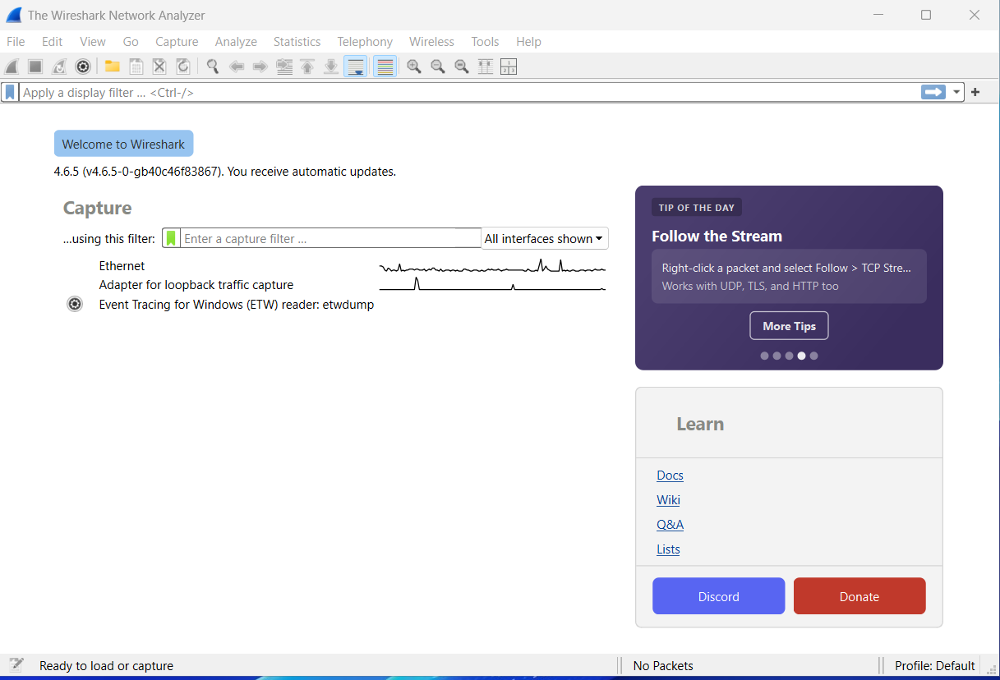
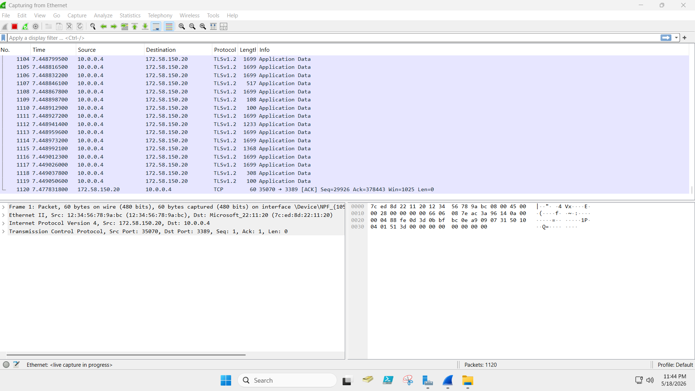
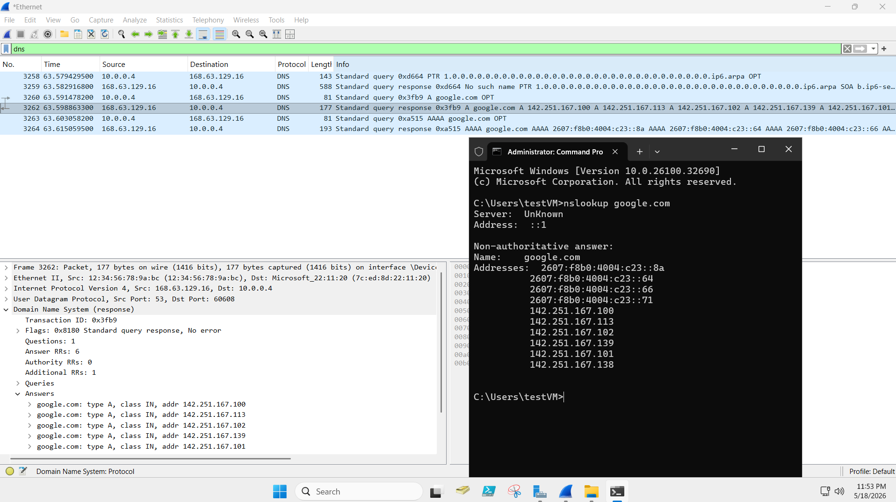
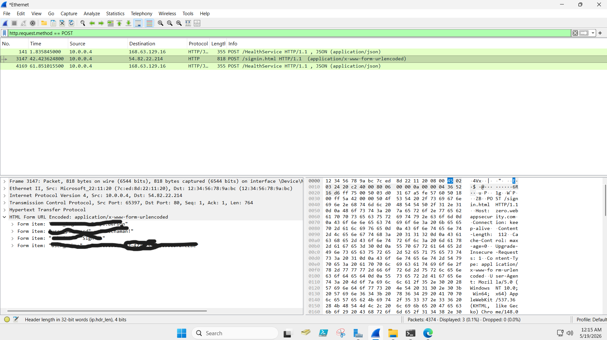
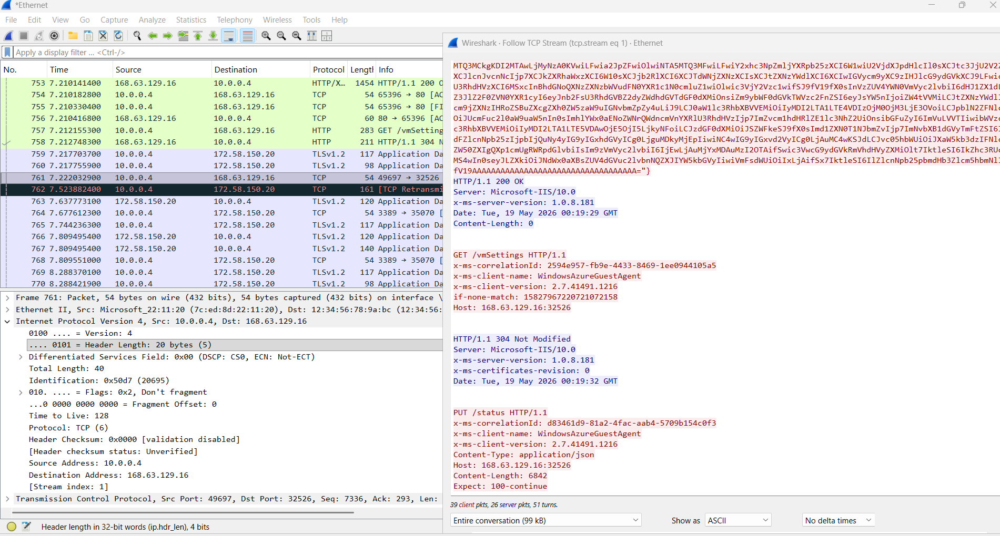

# Wireshark Network Analysis Lab

This project documents a hands-on Wireshark lab where I captured and analyzed network traffic in a Microsoft Azure virtual machine environment.

The goal of this lab was to practice packet capture, protocol analysis, and basic network security concepts used in IT support, networking, and cybersecurity roles.

## Skills Practiced

- Packet capture with Wireshark
- DNS traffic analysis
- TCP stream inspection
- HTTP vs HTTPS awareness
- Identifying source and destination IP addresses
- Using filters to isolate traffic
- Reading packet details
- Technical documentation

---

## Step 1 - Wireshark Setup and Packet Capture

### Objective

Set up Wireshark and begin capturing live network traffic from the active Ethernet interface.

### Steps Taken

1. Opened Wireshark on the virtual machine
2. Selected the active Ethernet interface
3. Started a live packet capture
4. Reviewed packet details such as source IP, destination IP, protocol, and packet length

### Screenshot

### What I Learned

This helped me understand how network traffic appears in real time and how Wireshark organizes packet data for analysis.

---

## Step 2 - DNS Lookup Analysis

### Objective

Generate DNS traffic using `nslookup` and analyze the DNS query and response packets in Wireshark.

### Steps Taken

1. Opened Command Prompt
2. Ran `nslookup google.com`
3. Applied a DNS filter in Wireshark
4. Reviewed the DNS query and response packets
5. Identified returned IPv4 and IPv6 addresses

### Screenshot

### What I Learned

This helped me understand how domain names are translated into IP addresses and how DNS traffic can be viewed inside a packet capture.

---

## Step 3 - HTTP POST Traffic Analysis

### Objective

Analyze insecure HTTP traffic and understand why sensitive data should not be transmitted over unencrypted websites.

### Steps Taken

1. Visited an intentionally insecure HTTP test website
2. Submitted test login information
3. Applied an HTTP POST filter in Wireshark
4. Located form data inside the packet details
5. Redacted sensitive values before publishing the screenshot

### Screenshot

### What I Learned

This showed how credentials submitted over HTTP can be visible in packet captures. It reinforced why HTTPS is important for protecting sensitive information in transit.

---

## Step 4 - TCP Stream Analysis

### Objective

Use Wireshark’s Follow TCP Stream feature to inspect communication between systems.

### Steps Taken

1. Selected a TCP packet
2. Used Follow TCP Stream
3. Reviewed the conversation between client and server
4. Observed HTTP request and response data
5. Identified how application data appears inside a stream

### Screenshot

### What I Learned

This helped me understand how TCP streams can be used to follow a conversation between two systems and inspect application-level communication.

---

## Key Takeaways

This lab helped me better understand:

- How devices communicate over a network
- How DNS queries and responses work
- How HTTP traffic can expose sensitive data
- Why HTTPS encryption matters
- How Wireshark can support troubleshooting and security analysis
- How to document technical labs clearly for GitHub

---

## Tools Used

- Wireshark
- Microsoft Azure Virtual Machine
- Windows Command Prompt
- GitHub

---

## Future Improvements

As I continue learning, I plan to:

- Analyze more protocols
- Practice additional Wireshark filters
- Build more networking labs
- Add more screenshots and notes
- Continue improving my documentation skills
